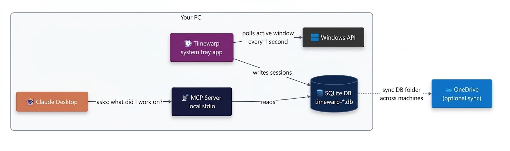

# Timewarp

## TL;DR

**Timewarp helps you fill out your timesheets without having to keep track yourself.**

It runs quietly on your Windows PC and watches which window is in front — that's it. It notes the app name and window title (like `25-125_SLD-E101.dwg - AutoCAD`) and saves it to a local SQLite database on your computer. Nothing is uploaded or shared — **you control the data**, and it never leaves your machine unless you choose to sync it (e.g. via OneDrive). This is not a corporate monitoring tool. It's a personal utility that works for you.

When it's time to fill out your timecard, you open your AI assistant and ask in plain English:

> *"What did I work on this week?"*

It reads your local data and tells you: "You spent 4 hours in AutoCAD on project 25-125, 1 hour in a design review meeting, 30 minutes on emails..." — and you copy that into your timesheet. Done.

**How it works under the hood:** Every second, Timewarp checks which window is active using the Windows API. It groups those seconds into sessions (ignoring brief alt-tabs), extracts project numbers from file names when possible, and stores everything in a local SQLite database. Your AI assistant accesses this database through a local [MCP](https://modelcontextprotocol.io/) connection — the same way it accesses files on your computer — and can answer questions about your work history.

**Compatible with any MCP-enabled AI app**, including Claude Desktop, ChatGPT Desktop, and others that support the Model Context Protocol.

---

## Architecture



> **Everything stays on your machine.** The MCP server is a local process that communicates with your AI app over stdin/stdout — it does not open any network ports or send data anywhere.

---

## Installation

### Step 1: Download and run

Download `timewarp.exe` from the [latest release](https://github.com/vinistoisr/timewarp/releases/latest), put it somewhere permanent (e.g. `C:\Tools\Timewarp\timewarp.exe`), and double-click it.

### Step 2: First-run setup

On the first launch, Timewarp walks you through setup automatically:

1. **Choose a data folder** — A dialog explains your options and opens a folder picker. Pick a folder inside OneDrive if you use multiple computers (each PC saves its own file, no sync conflicts), or any local folder if you only use one machine.
2. **Start at login** — Timewarp asks if you want it to run automatically when you log in. If you click Yes, a UAC prompt will appear (it needs admin rights to create the scheduled task). You can remove this later with `timewarp.exe -uninstall`.

> **Don't have admin rights?** Skip the UAC prompt and instead create a shortcut to `timewarp.exe` in your Startup folder. Press `Win+R`, type `shell:startup`, and drag the shortcut there. It works the same way — Timewarp will start every time you log in.

After setup, a small purple clock icon appears in your system tray — Timewarp is now tracking.

### Step 3: Connect to your AI app

Right-click the tray icon and click **Connect to Claude Desktop**. Timewarp automatically finds your Claude Desktop config file and adds itself. Restart Claude Desktop and you're done.

> **Using ChatGPT Desktop or another MCP-compatible app?** Click **Copy MCP Config** instead — this copies the JSON to your clipboard so you can paste it into your app's config file manually. The MCP server config looks like this:
>
> ```json
> {
>   "mcpServers": {
>     "timewarp": {
>       "command": "C:\\Tools\\Timewarp\\timewarp.exe",
>       "args": ["-mcp", "-dbpath", "C:\\Users\\You\\OneDrive\\TimewarpData"]
>     }
>   }
> }
> ```

Once connected, you can ask things like:

- *"What did I work on this week?"*
- *"How much time did I spend in AutoCAD?"*
- *"Break down my week by day for my timecard"*
- *"List my top apps this week"*

---

## What to Ask

Once Timewarp is running and connected, just ask in plain English. Here are some examples:

| What you want | What to type |
|---------------|-------------|
| Fill out your weekly timecard | *"Summarize my work this week for my timecard"* |
| Daily breakdown for QuickBooks Time | *"Break down my work by day this week, with hours per project"* |
| Check time on a specific project | *"How much time did I spend on project 25-125 this week?"* |
| See what you did on a specific day | *"What did I work on last Tuesday?"* |
| Find out where your time went | *"What were my top apps this week and how long did I use each?"* |
| Generate a timesheet narrative | *"Write a timesheet entry for this week, grouped by project number"* |
| Check meeting time | *"How many hours of meetings did I have this week?"* |
| Compare weeks | *"Compare my project time this week vs last week"* |
| Catch untracked time | *"I was on site Monday with no laptop — can you show me Tuesday through Friday only?"* |

Your AI app will call the appropriate Timewarp tools automatically. You don't need to know the tool names or syntax — just describe what you need.

---

## System Tray Menu

Right-click the tray icon to access these options:

| Menu Item | What it does |
|-----------|-------------|
| **Stop Tracking / Start Tracking** | Pause and resume tracking. The icon turns grey when paused. |
| **Inactivity Threshold** | How long you must be idle before time stops counting (30s, 1m, 2m, 5m, 10m). Default: 1 minute. |
| **Enable Prometheus Endpoint** | Toggle the Prometheus metrics HTTP server on/off (off by default). |
| **Open DB Folder** | Opens your database folder in Explorer. |
| **Set DB Folder...** | Pick a new folder for the database. Takes effect immediately. |
| **Connect to Claude Desktop** | Automatically adds Timewarp to Claude Desktop's config. Shows a checkmark when connected. |
| **Copy MCP Config** | Copies MCP server config JSON to your clipboard (for ChatGPT Desktop or other MCP apps). |
| **Quit** | Stops Timewarp. |

---

## MCP Tools

These are the tools your AI app can call to query your data:

| Tool | Description |
|------|-------------|
| `get_weekly_summary` | Attributed project time, unattributed app time, meetings, and inactivity for a week. |
| `get_daily_breakdown` | Same data broken down by day — ideal for filling out daily timecards or QuickBooks Time. |
| `get_focus_time` | Total focused minutes for a specific process across a date range. |
| `list_top_apps` | Top 10 processes by focused time for a week. |

### Example: Weekly Summary

Ask: *"Summarize my work this week for my timecard"*

Your AI app calls `get_weekly_summary` and receives:

```json
{
  "week": "2026-03-02/2026-03-08",
  "machines": ["DESKTOP-VINC", "LAPTOP-VINC"],
  "attributed": [
    {
      "project_number": "25-125",
      "total_minutes": 252,
      "processes": ["acad.exe", "OUTLOOK.EXE", "Bluebeam Revu"],
      "sample_titles": ["25-125_SLD-E101.dwg - AutoCAD"]
    }
  ],
  "unattributed": [
    { "process": "chrome.exe", "total_minutes": 48, "sample_titles": ["..."] }
  ],
  "meetings": [
    { "subject": "25-019 Design Review", "total_minutes": 62, "sessions": 2 }
  ],
  "inactivity_minutes": 94
}
```

---

## How Sessions Work

Timewarp doesn't just record every second individually. It stitches activity into sessions:

- **Gaps under 30 seconds** in the same app are bridged (you alt-tabbed to copy something and came back)
- **Sessions under 10 seconds** are discarded (you accidentally clicked the wrong window)
- **Project numbers** are extracted from window titles using the pattern `YY-NNN` (e.g. `25-125` from `25-125_SLD-E101.dwg`)
- **Meetings** are detected from Teams/Zoom/Webex window titles
- **Suppressed processes** like `mstsc.exe` (Remote Desktop), `LockApp.exe`, and `ShellExperienceHost.exe` are never recorded

---

## Command-line Flags

| Flag | Description | Default |
|------|-------------|---------|
| `-dbpath` | Directory for database files | Same directory as executable |
| `-mcp` | Run as MCP stdio server (used by AI desktop apps) | `false` |
| `-install` | Create a Windows startup scheduled task | |
| `-uninstall` | Remove the startup scheduled task | |
| `-silent` | Run without system tray icon | `false` |
| `-inactivityThreshold` | Inactivity threshold in seconds | `60` |
| `-interface` | Network interface for Prometheus | All interfaces |
| `-port` | Prometheus metrics port | `9183` |
| `-private` | Replace window titles with process names in metrics | `false` |
| `-debug` | Print debug output to console | `false` |

---

## Prometheus Metrics (Optional)

Timewarp can expose a Prometheus endpoint for real-time dashboarding. It is **off by default** — enable it from the tray menu or by toggling it on.

Endpoint: `http://localhost:9183/metrics`

| Metric | Type | Description |
|--------|------|-------------|
| `focused_window_pid` | Gauge | PID of the currently focused window |
| `focused_window_duration_seconds` | Counter | Total seconds focused per process |
| `focused_window_changes_total` | Counter | Number of focus changes |
| `focus_inactivity_seconds_total` | Counter | Total seconds of inactivity |
| `meeting_duration_seconds` | Counter | Seconds spent in meetings |

---

## Building from Source

```
git clone https://github.com/vinistoisr/timewarp.git
cd timewarp
go build -ldflags "-H=windowsgui" -o timewarp.exe .
```

Requires Go 1.24+.
